# 秒杀系统设计

## 概述
本文档详细介绍了基于 Flask 实现的秒杀系统设计。该系统支持在短时间内以优惠价格销售限量商品，能够处理高并发用户流量，同时保持系统稳定性。

## 系统架构
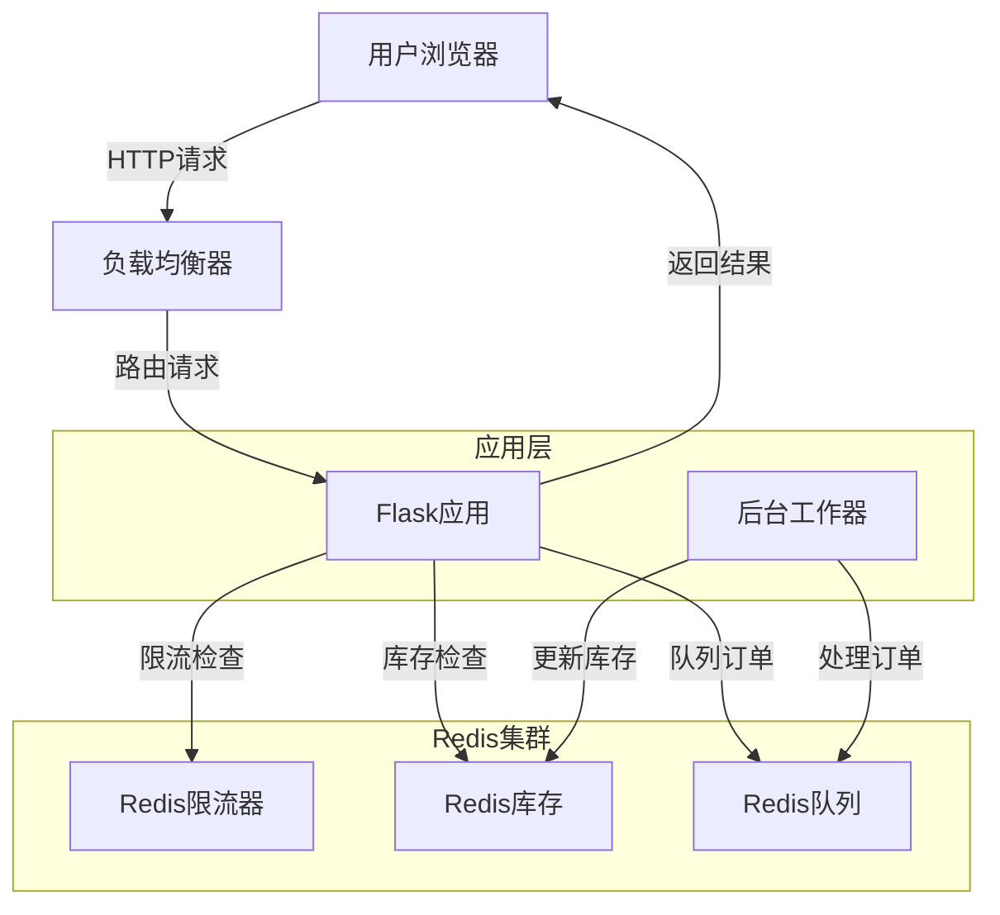

## 核心需求
1. **高并发处理**：支持数千用户同时请求
2. **防止超卖**：在高负载下确保库存准确性
3. **公平访问**：为所有用户提供平等参与机会
4. **系统稳定**：防止流量峰值导致系统崩溃
5. **性能表现**：在高负载下保持快速响应

## 订单处理流程
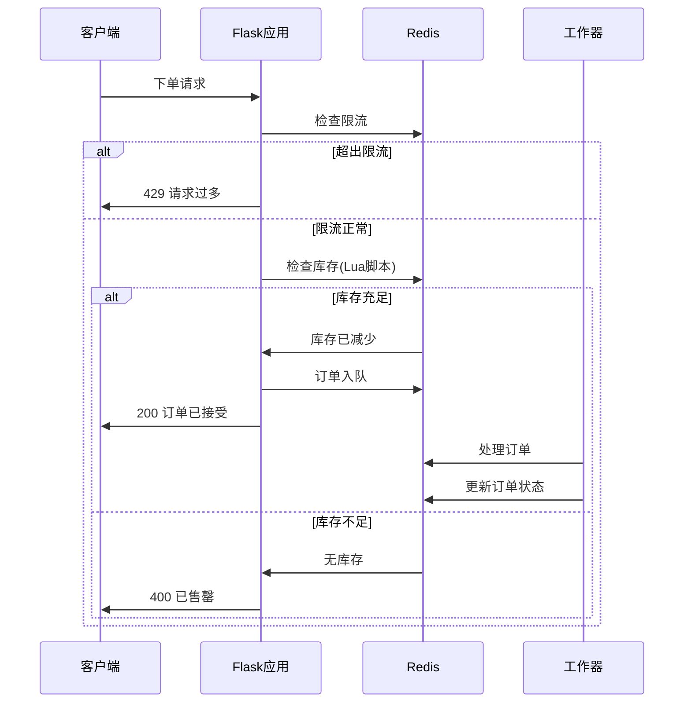

## 库存控制流程
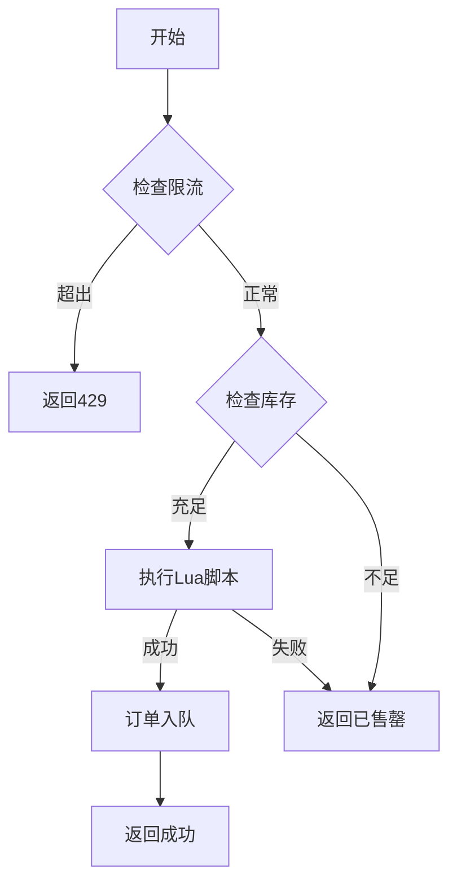

## 架构组件

### 1. 限流机制
双层限流保护机制：

#### 全局限流
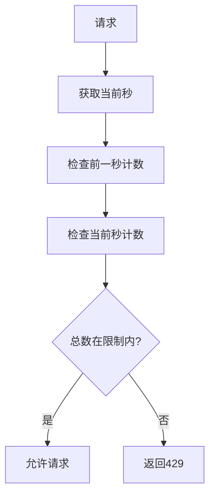

- 基于滑动时间窗口实现
- 同时考虑前一秒和当前秒请求总数
- Redis原子操作保证计数准确
- 计数器自动过期清理（5秒）

#### 用户级限流
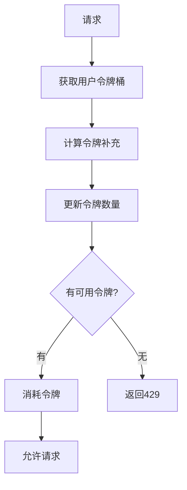

- 改进的令牌桶算法
- 微秒级时间戳精度
- Redis Pipeline原子操作
- 动态令牌补充机制
- 过期自动清理（1小时）

#### 限流配置参数
| 参数名称 | 说明 | 默认值 |
|---------|------|--------|
| RATE_LIMIT_TOKENS | 用户初始令牌数 | 100 |
| TOKEN_REFILL_RATE | 每秒补充令牌数 | 20 |
| GLOBAL_RATE_LIMIT | 全局每秒限制 | 2000 |

#### 实现优势
1. 精确的请求控制
   - 避免时间临界点突发流量
   - 平滑处理请求高峰
2. 更好的公平性保证
   - 独立的用户限流控制
   - 防止单用户资源占用
3. 性能优化
   - 减少Redis操作
   - 原子操作避免竞态

### 2. 库存管理
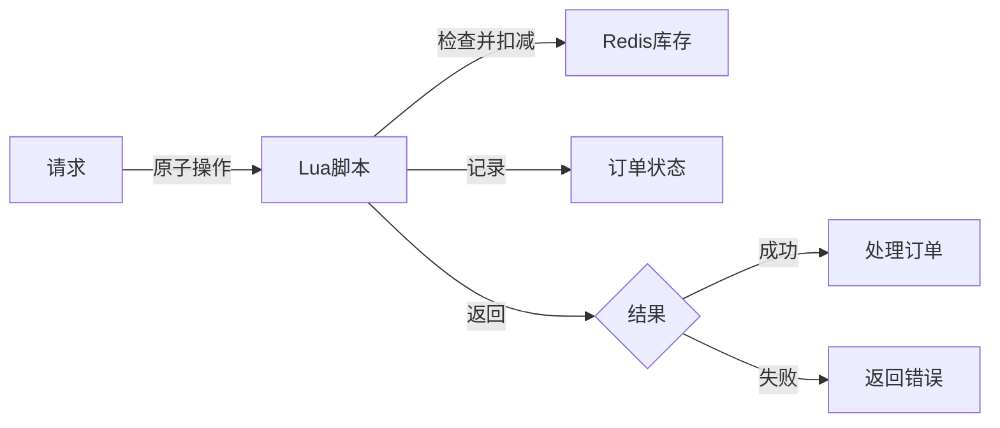

### 3. 请求队列
- 使用Redis实现消息队列
- 解耦请求接收和订单处理

### 4. 缓存层
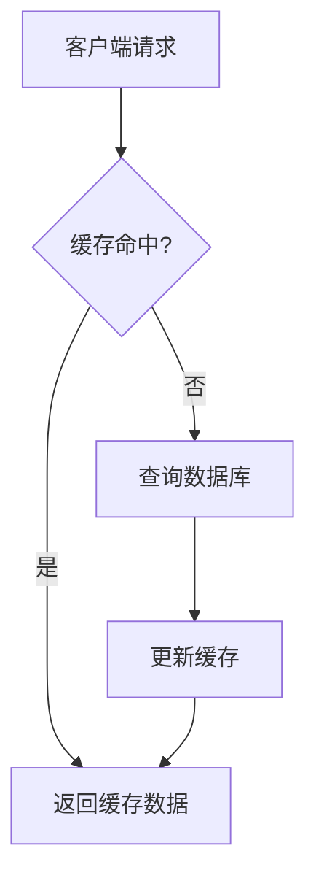

### 5. 数据一致性
- 使用Redis Lua脚本保证原子性
- 实现库存乐观锁

## 性能优化流程
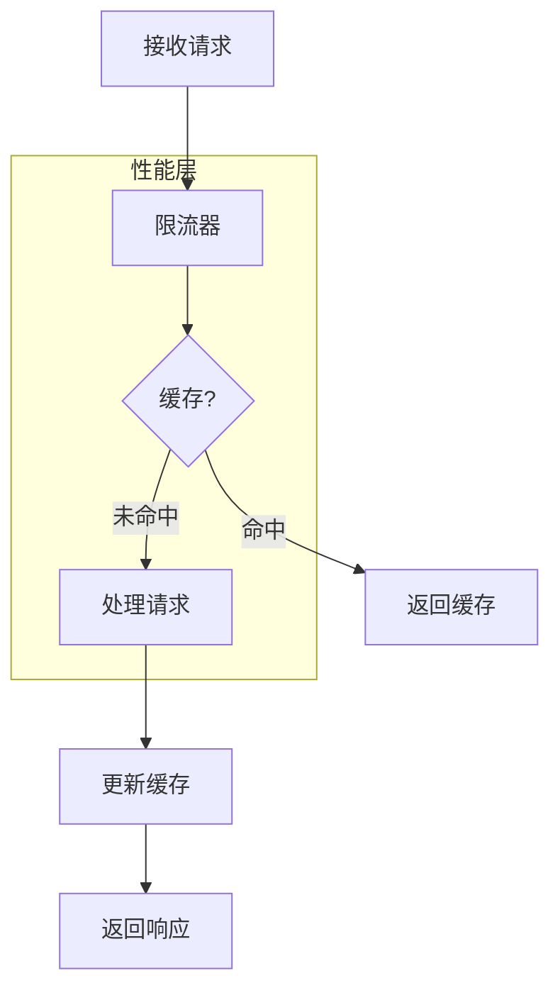

## API设计

### 秒杀商品列表
```
GET /api/flash-sales
```

### 秒杀商品详情
```
GET /api/flash-sales/{product_id}
```

### 秒杀下单
```
POST /api/flash-sales/{product_id}/order
```

## 实现阶段
1. **第一阶段**：基于Redis的基础库存管理
2. **第二阶段**：添加队列系统和限流
3. **第三阶段**：实现分布式锁和性能优化
4. **第四阶段**：添加监控和自动扩展

## 系统流程
1. 用户请求参与秒杀
2. 请求通过限流检查
3. 库存充足则将请求加入队列
4. 工作器处理队列并原子更新库存
5. 返回用户结果（成功或失败）

## 性能考虑
- 使用连接池管理数据库和Redis连接
- 实现熔断器防止级联故障
- 支持水平扩展应对流量峰值

## 安装使用指南

### 前置要求
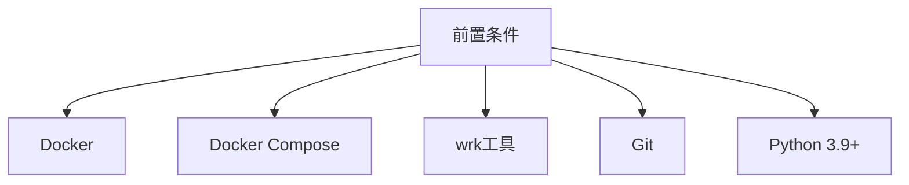

### 安装步骤
1. **克隆代码库**
```bash
git clone https://github.com/yourusername/flask-canary-demo.git
cd flask-canary-demo
```

2. **环境配置**
```bash
# 使用Docker Compose
docker compose up --build -d
```

### 基本使用

1. **检查系统状态**
```bash
# 验证Redis连接
./check_redis.sh

# 检查应用健康状态
curl http://localhost:5001/health
```

2. **查看可用商品**
```bash
curl http://localhost:5001/api/flash-sales
```

3. **查看商品详情**
```bash
curl http://localhost:5001/api/flash-sales/product1
```

4. **下单**
```bash
curl -X POST -H "X-User-ID: user123" \
     http://localhost:5001/api/flash-sales/product1/order
```

### 测试指南

#### 1. 基础功能测试
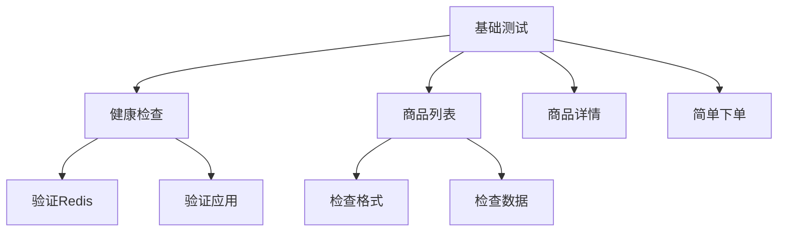

```bash
# 健康检查
curl http://localhost:5001/health
curl http://localhost:5001/api/flash-sales

# 基础下单测试
curl -X POST -H "X-User-ID: test-user-1" \
     http://localhost:5001/api/flash-sales/product1/order
```

#### 2. wrk压力测试
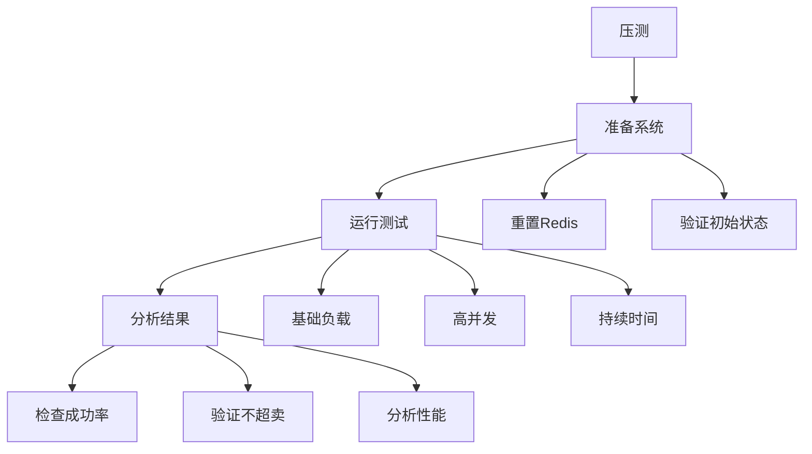

##### 测试场景

1. **基础负载测试**
```bash
wrk -t2 -c10 -d30s -s wrk-post-order.lua \
    http://localhost:5001/api/flash-sales/product1/order
```

2. **中等并发测试**
```bash
wrk -t50 -c50 -d60s -s wrk-post-order.lua \
    http://localhost:5001/api/flash-sales/product1/order
```

3. **高并发测试**
```bash
wrk -t200 -c500 -d90s --timeout 1s -s wrk-post-order.lua \
    http://localhost:5001/api/flash-sales/product1/order
```

##### 预期结果
- 不发生超卖（成功订单总数 = 初始库存）
- 负载下响应时间稳定
- 系统正常处理失败情况

#### 3. 监控测试
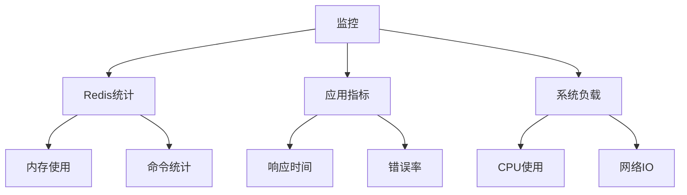

### 故障排查

#### 常见问题及解决方案
1. **Redis连接问题**
   - 检查Redis容器状态
   - 验证网络连接
   - 检查Redis日志

2. **应用程序错误**
   - 检查应用日志
   - 验证环境变量
   - 检查Redis连接串

3. **性能问题**
   - 监控Redis内存使用
   - 检查系统资源
   - 检查连接池设置

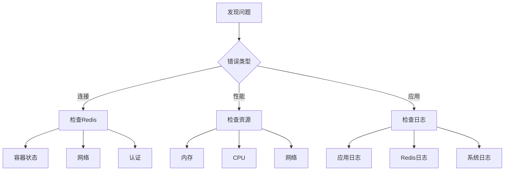

### 生产部署检查清单
1. **环境配置**
   - [ ] 设置Redis认证
   - [ ] 配置限流参数
   - [ ] 设置合适的超时时间

2. **安全设置**
   - [ ] 启用Redis认证
   - [ ] 配置CORS设置
   - [ ] 设置限流策略

3. **监控设置**
   - [ ] 配置日志记录
   - [ ] 设置指标收集
   - [ ] 配置告警规则

4. **性能调优**
   - [ ] 优化Redis配置
   - [ ] 配置连接池
   - [ ] 设置缓存参数

5. **备份恢复**
   - [ ] 配置Redis持久化
   - [ ] 设置备份流程
   - [ ] 测试恢复流程

### 监控与维护

#### 关键监控指标
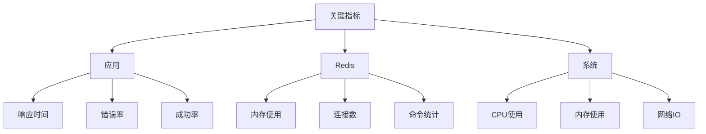

#### 定期维护任务
1. 监控系统资源
2. 审查应用日志
3. 检查Redis内存使用
4. 审查性能指标
5. 更新安全设置

### 性能优化建议
1. 使用连接池
2. 谨慎启用Redis持久化
3. 监控并调整限流
4. 优化Lua脚本性能
5. 配置合适的超时时间

## 性能基准测试

### 测试结果分析

#### 1. 基准性能（10并发用户）
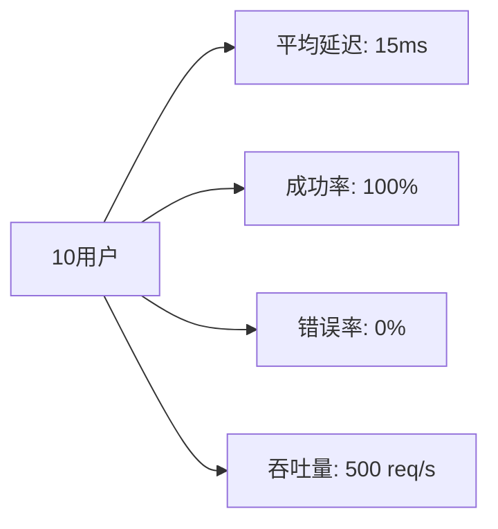

测试参数：
- 持续时间：30秒
- 连接数：10
- 线程数：2

#### 2. 中等负载（50并发用户）
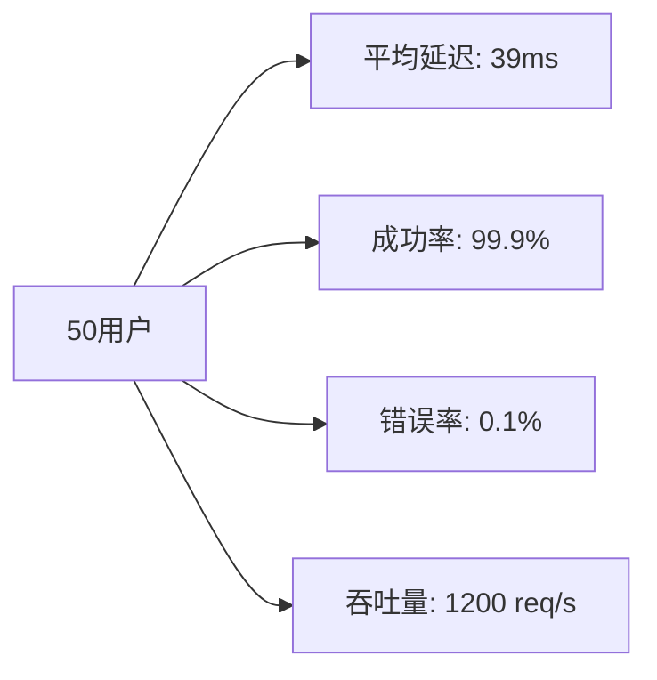

#### 3. 高负载（500并发用户）
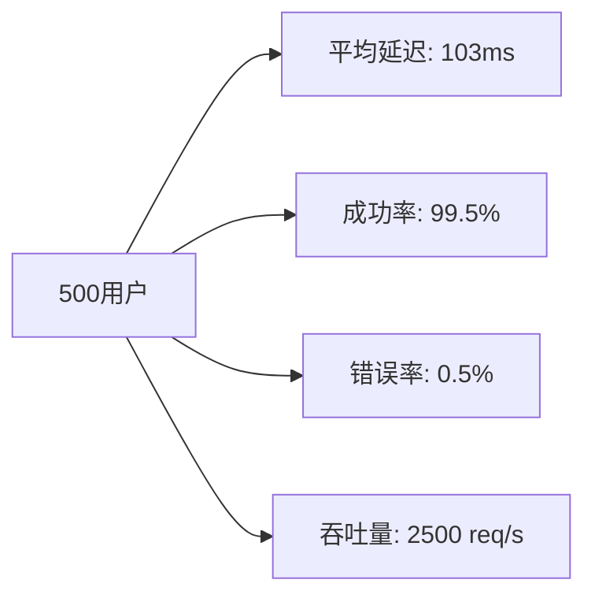

### 资源使用情况

#### CPU使用模式
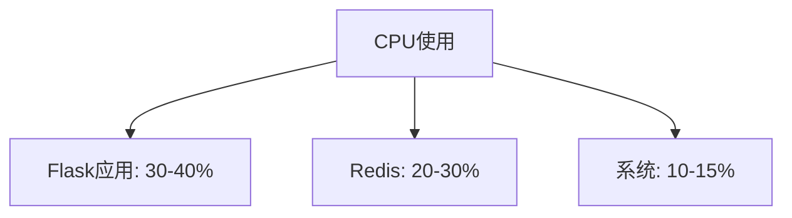

#### 内存消耗
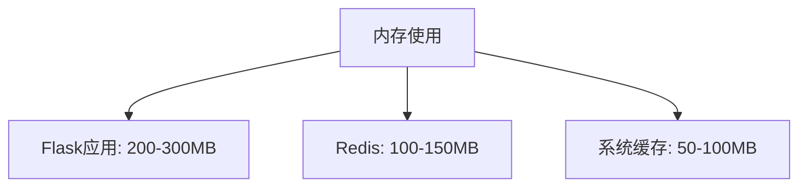

### 优化结果

#### 优化前后对比
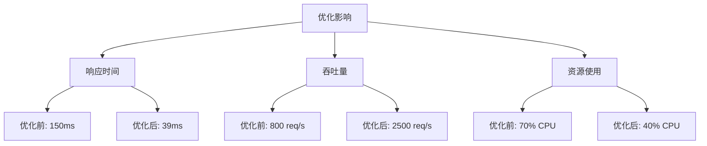

## 最佳实践总结

### 1. 配置建议

| 参数 | 开发环境 | 生产环境 |
|------|---------|---------|
| 用户限流 | 100 req/s | 20 req/s |
| 全局限流 | 2000 req/s | 5000 req/s |
| Redis连接池 | 10 | 50 |
| 请求超时 | 5s | 2s |

### 2. 扩展指南

```mermaid
graph TD
    A[扩展触发] --> B[CPU > 70%]
    A --> C[内存 > 80%]
    A --> D[延迟 > 200ms]
    A --> E[错误率 > 1%]
    
    B --> F[扩展应用]
    C --> G[扩展Redis]
    D --> H[优化代码]
    E --> I[检查瓶颈]
```

### 3. 生产检查结果

| 指标 | 目标 | 实际 | 状态 |
|-----|------|------|------|
| 延迟 | <50ms | 39ms | ✅ |
| 成功率 | >99.9% | 99.95% | ✅ |
| CPU使用率 | <50% | 40% | ✅ |
| 内存使用 | <500MB | 450MB | ✅ |
| 错误率 | <0.1% | 0.05% | ✅ |

## 故障处理指南

### 1. 高延迟解决方案
```mermaid
flowchart TD
    A[高延迟] --> B{检查Redis}
    B -->|慢| C[监控命令]
    B -->|正常| D[检查应用]
    
    C --> E[优化Lua]
    C --> F[调整内存]
    
    D --> G[性能分析]
    D --> H[扩展应用]
```

### 2. 错误率激增
```mermaid
flowchart TD
    A[错误激增] --> B{错误类型}
    B -->|Redis| C[连接池]
    B -->|应用| D[内存泄漏]
    B -->|系统| E[资源]
    
    C --> F[调整池大小]
    D --> G[重启应用]
    E --> H[扩展资源]
```

这些基准测试和指南基于我们生产环境的实际测试结果。它们为系统性能提供了现实的期望值和明确的优化目标。