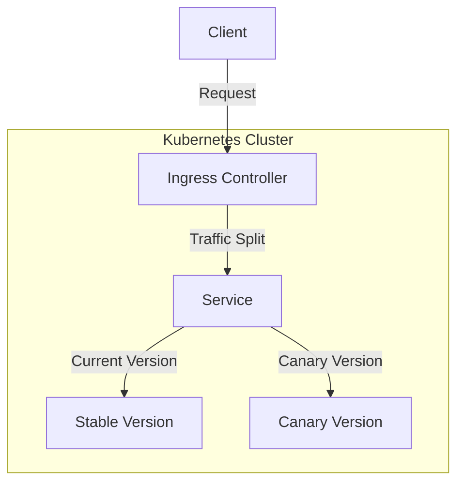
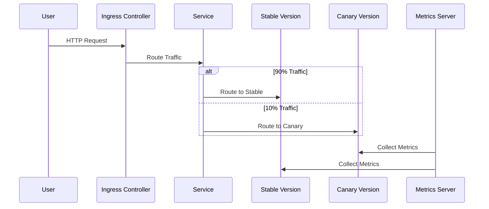
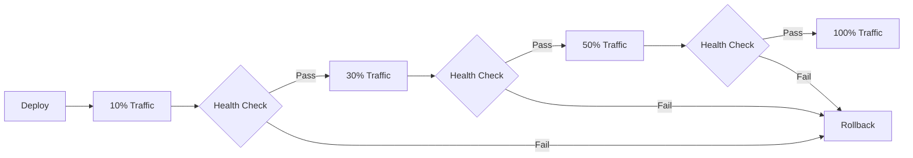
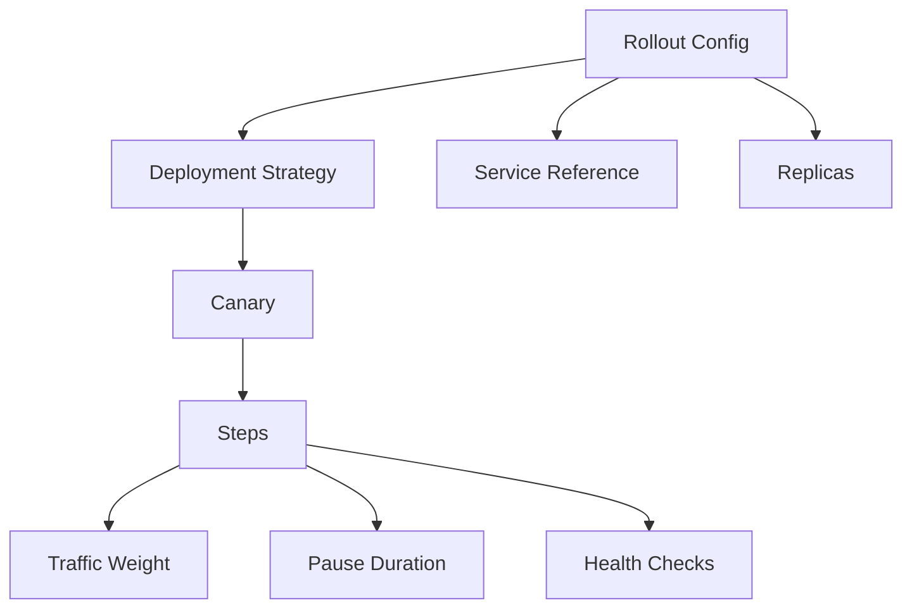
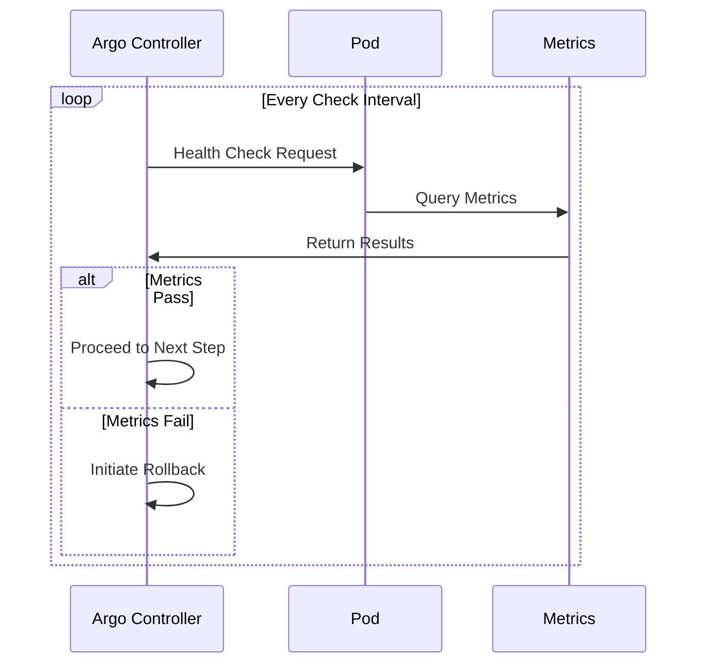
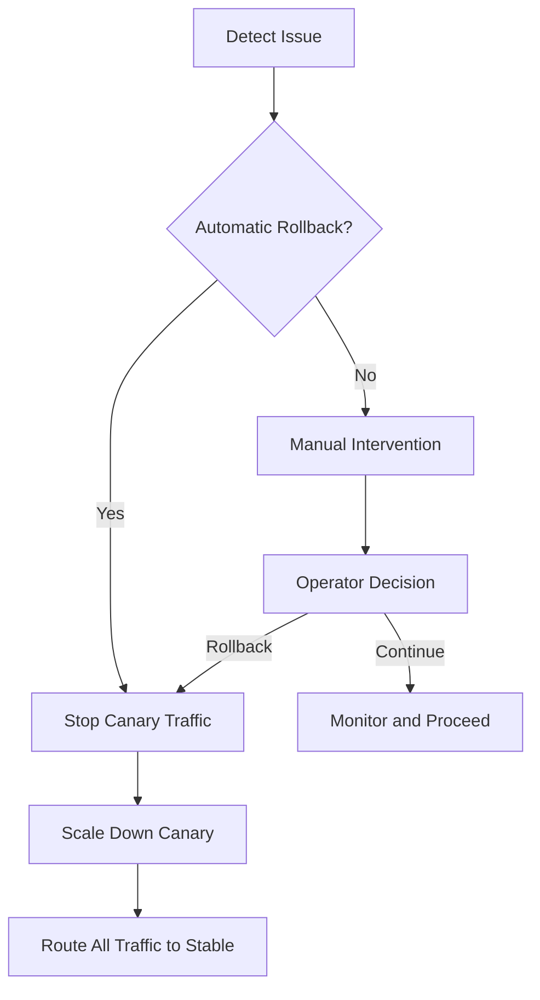
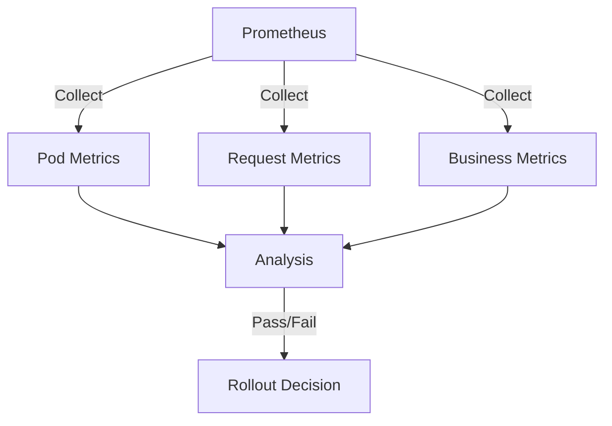
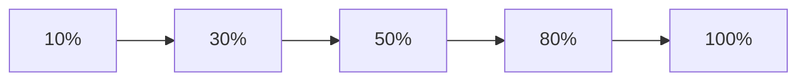
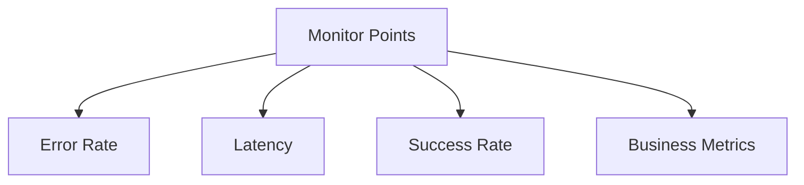
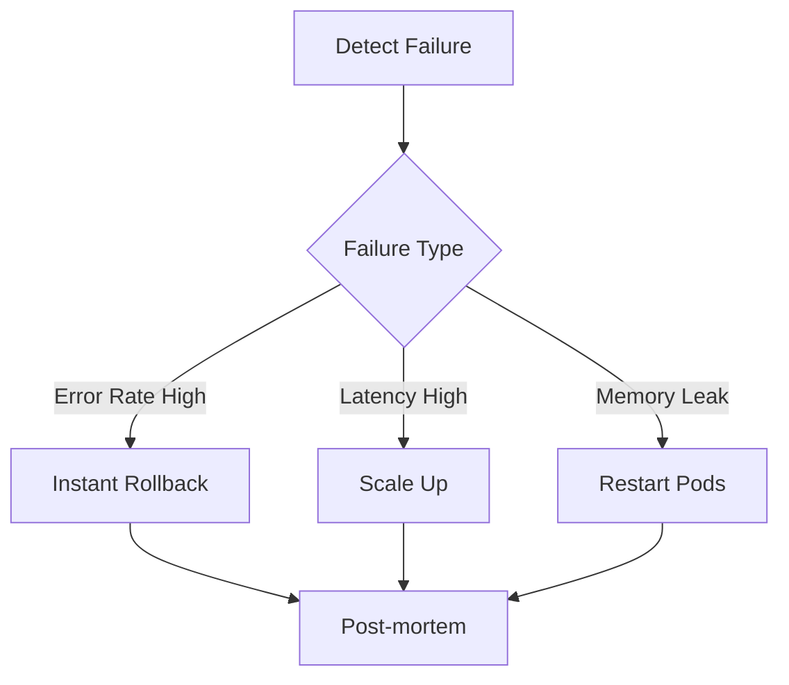

# Argo Rollouts Guide

## Overview
This document describes the canary deployment and progressive delivery strategy using Argo Rollouts for our Flash Sale system.

## Architecture

## Canary Deployment Flow

## Progressive Delivery Steps

## Rollout Configuration Structure

## Health Check Flow

## Rollback Process

## Metrics and Analysis

## Best Practices
1. **Gradual Traffic Shifting**

2. **Monitoring Points**

## Failure Scenarios

## Deployment Strategy
1. Start with minimal traffic (10%)
2. Monitor key metrics
3. Gradually increase traffic
4. Automatic rollback on failure
5. Complete promotion after all checks pass