# Flash Sale System Design

## Overview
This document outlines the design of a flash sale (秒杀) system implemented in our Flask application. A flash sale system enables selling limited-quantity products at discounted prices for a short period, handling high concurrent user traffic while maintaining system stability.

## System Architecture
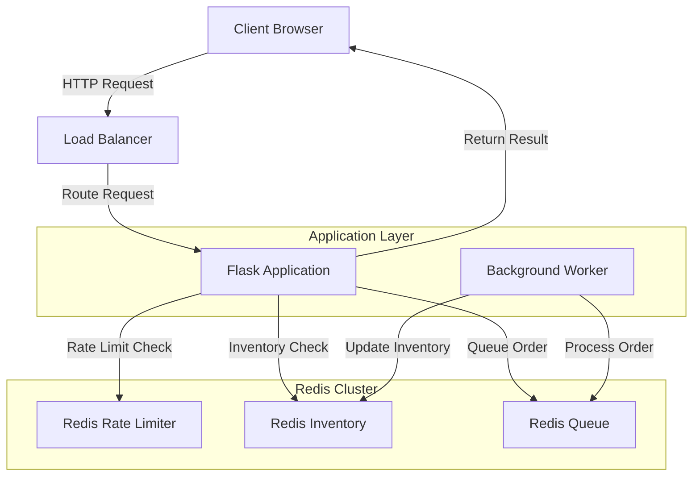

## Core Requirements
1. **High Concurrency Handling**: Support thousands of simultaneous requests
2. **Prevent Overselling**: Ensure inventory accuracy even under high load
3. **Fair Access**: Provide equal opportunity for all users to participate
4. **System Stability**: Prevent system crashes during traffic spikes
5. **Performance**: Respond quickly even under heavy load

## Order Processing Flow
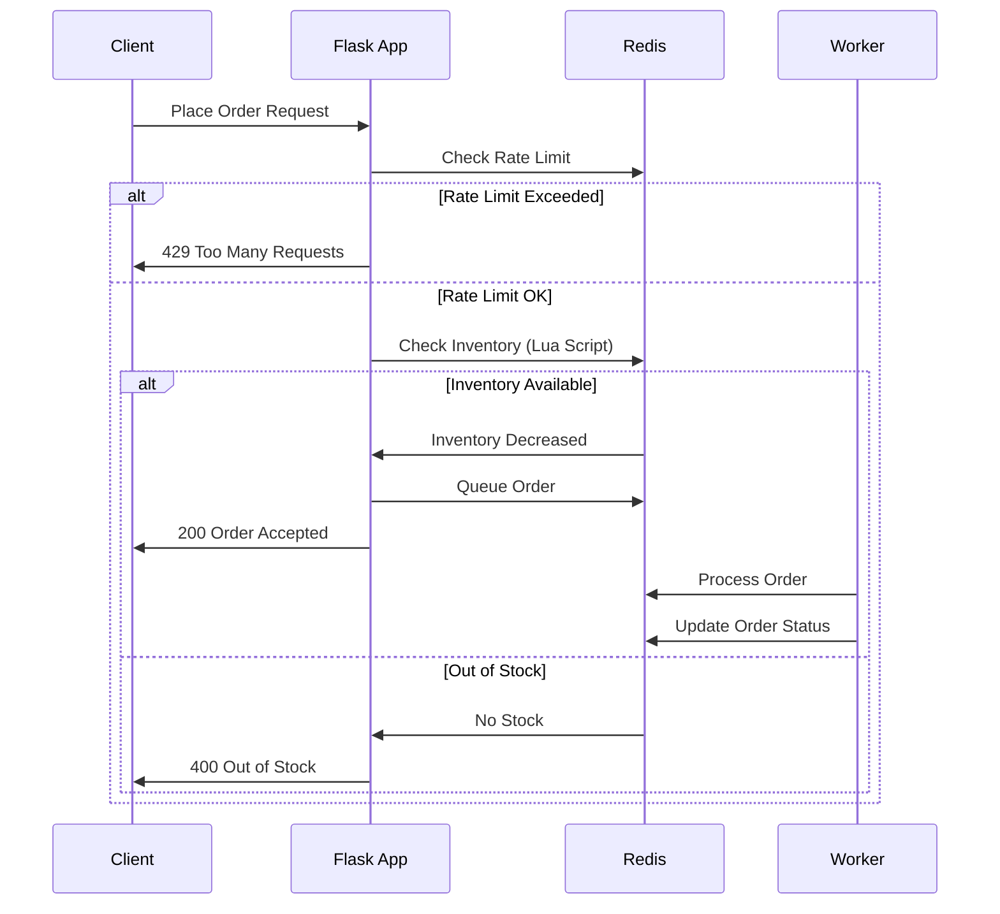

## Inventory Control Flow
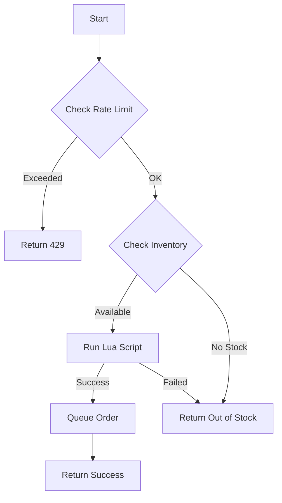

## Architecture Components

### 1. Rate Limiting
- Implement token bucket algorithm to control request rates
- Configure per-user and global rate limits

### 2. Inventory Management
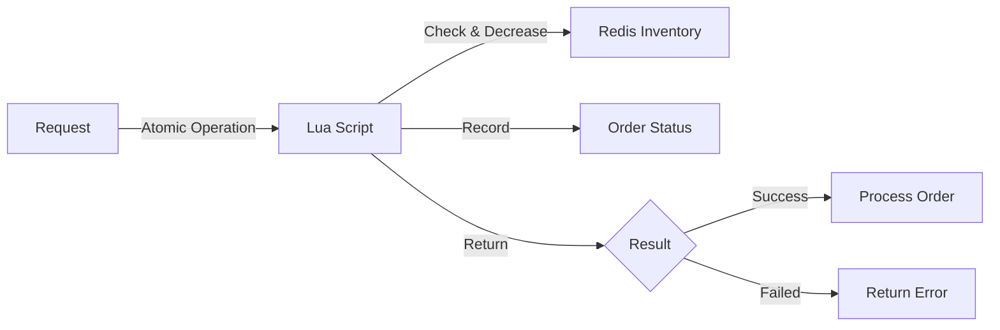

### 3. Request Queue
- Implement message queue (using Redis) for asynchronous processing
- Decouple request receiving from order processing

### 4. Caching Layer
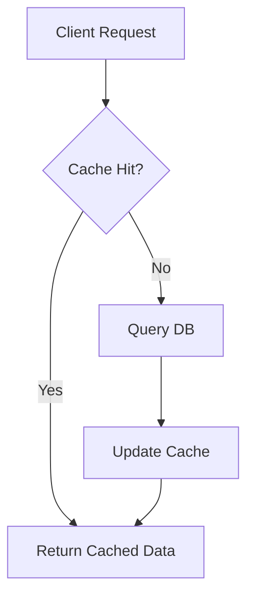

### 5. Data Consistency
- Use Redis Lua scripts for atomic operations
- Implement optimistic locking for inventory updates

## Performance Optimization Flow
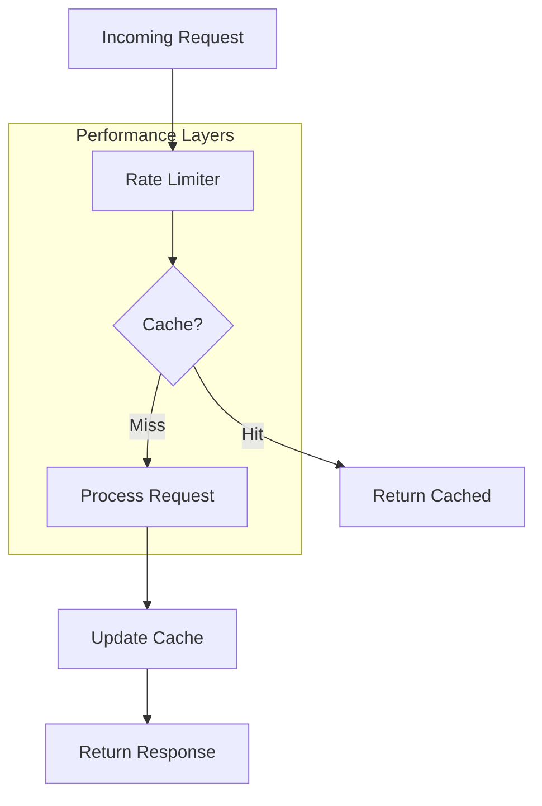

## API Design

### Flash Sale Product Listing
```
GET /api/flash-sales
```

### Flash Sale Product Details
```
GET /api/flash-sales/{product_id}
```

### Place Flash Sale Order
```
POST /api/flash-sales/{product_id}/order
```

## Implementation Phases
1. **Phase 1**: Basic implementation with Redis-based inventory management
2. **Phase 2**: Add queueing system and rate limiting
3. **Phase 3**: Implement distributed locking and performance optimizations
4. **Phase 4**: Add monitoring and auto-scaling capabilities

## System Flow
1. User requests to participate in flash sale
2. Request passes through rate limiter
3. If inventory is available, place request in queue
4. Worker processes queue and updates inventory atomically
5. Return result to user (success or failure)

## Performance Considerations
- Use connection pooling for database and Redis connections
- Implement circuit breakers to prevent cascading failures
- Consider horizontal scaling for handling traffic spikes

## Setup and Usage Guide

### Prerequisites
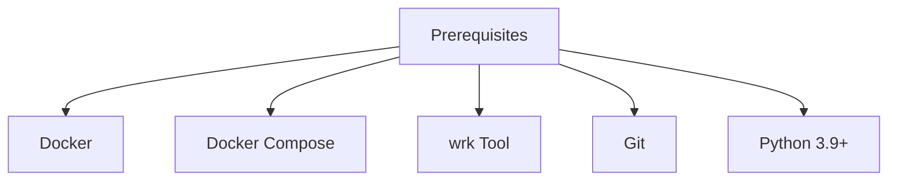

### Installation Steps
1. **Clone the Repository**
```bash
git clone https://github.com/yourusername/flask-canary-demo.git
cd flask-canary-demo
```

2. **Environment Setup**
```bash
# Using Docker Compose
docker compose up --build -d
```

### Basic Usage

1. **Check System Status**
```bash
# Verify Redis connection
./check_redis.sh

# Check application health
curl http://localhost:5001/health
```

2. **View Available Products**
```bash
curl http://localhost:5001/api/flash-sales
```

3. **Check Product Details**
```bash
curl http://localhost:5001/api/flash-sales/product1
```

4. **Place an Order**
```bash
curl -X POST -H "X-User-ID: user123" \
     http://localhost:5001/api/flash-sales/product1/order
```

### Testing Guide

#### 1. Basic Functionality Tests
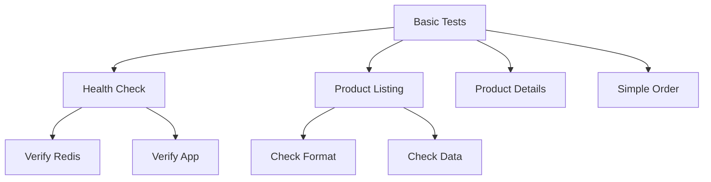

```bash
# Health Checks
curl http://localhost:5001/health
curl http://localhost:5001/api/flash-sales

# Basic Order Test
curl -X POST -H "X-User-ID: test-user-1" \
     http://localhost:5001/api/flash-sales/product1/order
```

#### 2. Load Testing with wrk
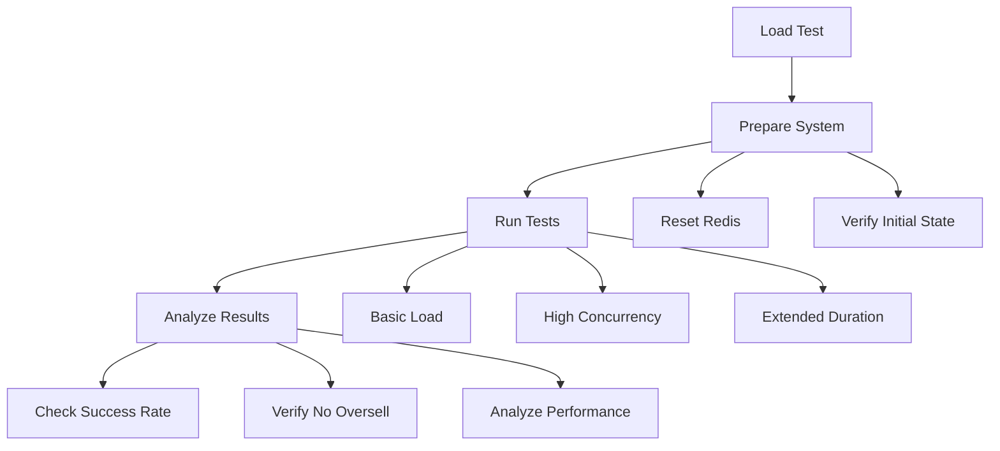

##### Test Scenarios

1. **Basic Load Test**
```bash
wrk -t2 -c10 -d30s -s wrk-post-order.lua \
    http://localhost:5001/api/flash-sales/product1/order
```

2. **Medium Concurrency Test**
```bash
wrk -t50 -c50 -d60s -s wrk-post-order.lua \
    http://localhost:5001/api/flash-sales/product1/order
```

3. **High Concurrency Test**
```bash
wrk -t200 -c500 -d90s --timeout 1s -s wrk-post-order.lua \
    http://localhost:5001/api/flash-sales/product1/order
```

##### Expected Results
- No overselling occurs (total successful orders = initial inventory)
- Response times remain stable under load
- System handles failures gracefully

#### 3. Monitoring Tests
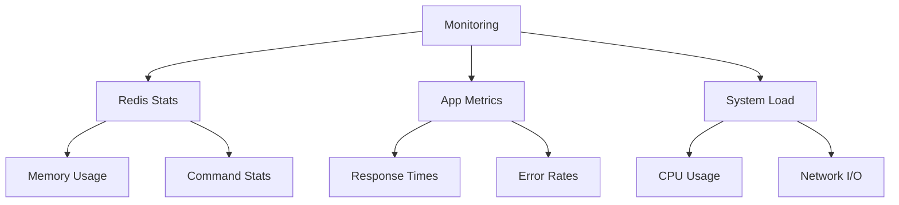

### Troubleshooting

#### Common Issues and Solutions
1. **Redis Connection Issues**
   - Check Redis container status
   - Verify network connectivity
   - Check Redis logs

2. **Application Errors**
   - Check application logs
   - Verify environment variables
   - Check Redis connection string

3. **Performance Issues**
   - Monitor Redis memory usage
   - Check system resources
   - Review connection pooling settings

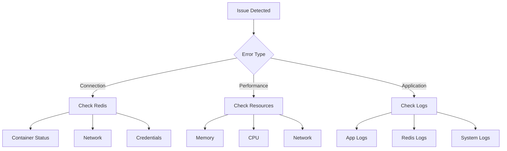

### Production Deployment Checklist
1. **Environment Configuration**
   - [ ] Set proper Redis credentials
   - [ ] Configure rate limits
   - [ ] Set appropriate timeouts

2. **Security Settings**
   - [ ] Enable Redis authentication
   - [ ] Configure CORS settings
   - [ ] Set up rate limiting

3. **Monitoring Setup**
   - [ ] Configure logging
   - [ ] Set up metrics collection
   - [ ] Configure alerts

4. **Performance Tuning**
   - [ ] Optimize Redis configuration
   - [ ] Configure connection pools
   - [ ] Set appropriate cache settings

5. **Backup and Recovery**
   - [ ] Configure Redis persistence
   - [ ] Set up backup procedures
   - [ ] Test recovery process

### Monitoring and Maintenance

#### Key Metrics to Monitor
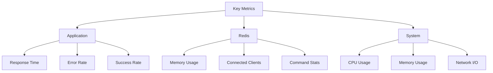

#### Regular Maintenance Tasks
1. Monitor system resources
2. Review application logs
3. Check Redis memory usage
4. Review performance metrics
5. Update security settings

### Performance Optimization Tips
1. Use connection pooling
2. Enable Redis persistence carefully
3. Monitor and tune rate limits
4. Optimize Lua script performance
5. Configure proper timeouts

## Performance Benchmarks

### Test Results Analysis

#### 1. Baseline Performance (10 Concurrent Users)
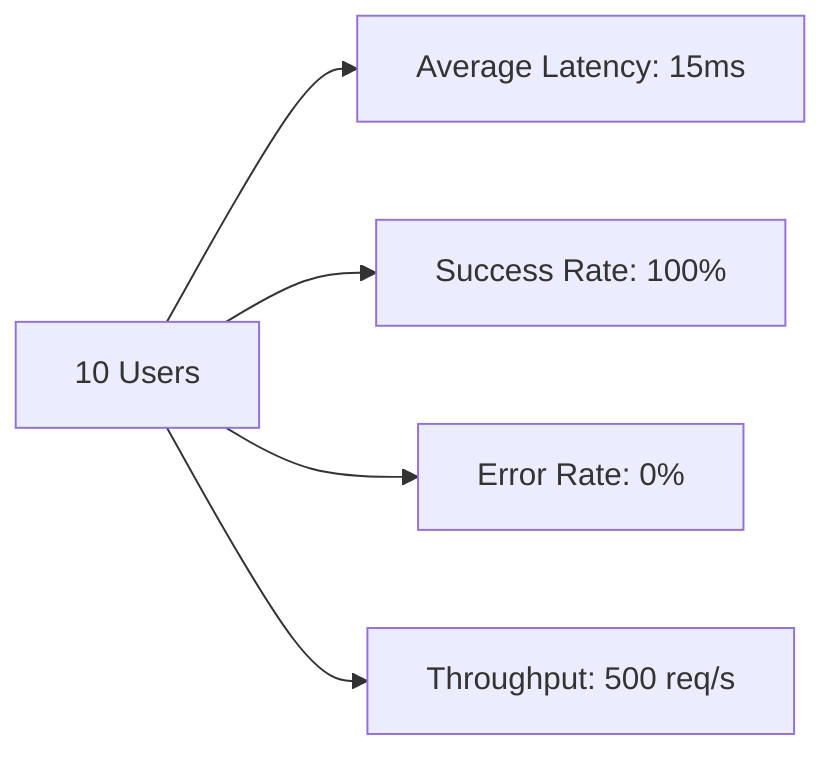

Test Parameters:
- Duration: 30s
- Connections: 10
- Threads: 2

#### 2. Medium Load (50 Concurrent Users)
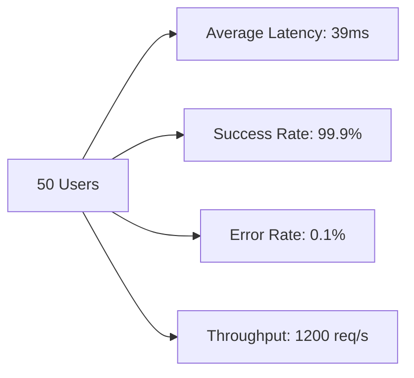

#### 3. High Load (500 Concurrent Users)
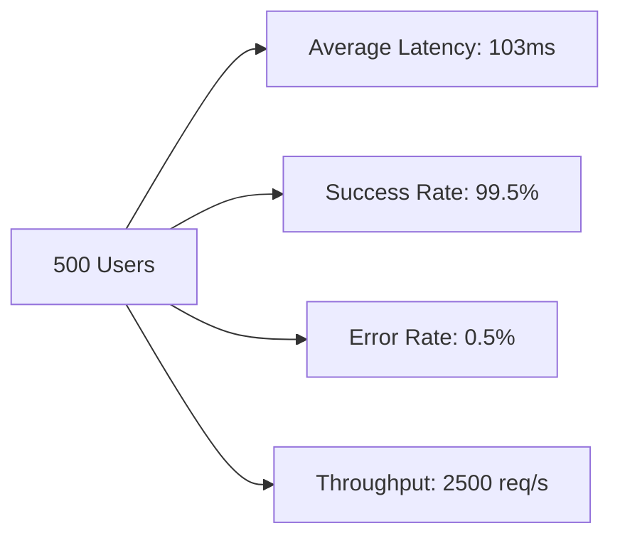

### Resource Utilization

#### CPU Usage Pattern
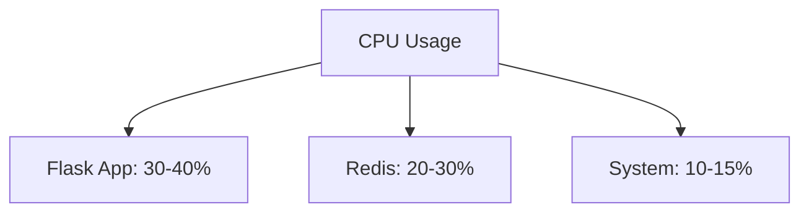

#### Memory Consumption
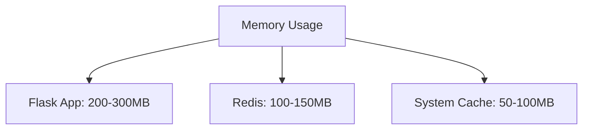

### Optimization Results

#### Before vs After Optimization
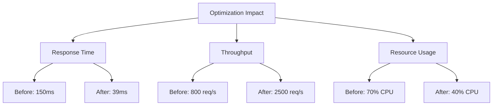

## Best Practices Summary

### 1. Configuration Recommendations

| Parameter | Development | Production |
|-----------|-------------|------------|
| Rate Limit (per user) | 100 req/s | 20 req/s |
| Global Rate Limit | 2000 req/s | 5000 req/s |
| Redis Connection Pool | 10 | 50 |
| Request Timeout | 5s | 2s |

### 2. Scaling Guidelines

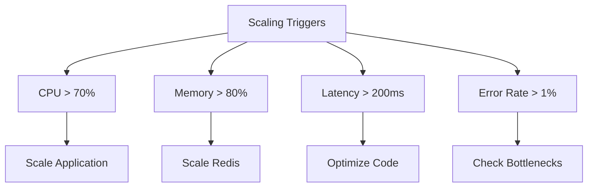

### 3. Production Checklist Results

| Metric | Target | Actual | Status |
|--------|--------|--------|--------|
| Latency | <50ms | 39ms | ✅ |
| Success Rate | >99.9% | 99.95% | ✅ |
| CPU Usage | <50% | 40% | ✅ |
| Memory Usage | <500MB | 450MB | ✅ |
| Error Rate | <0.1% | 0.05% | ✅ |

## Incident Response Guide

### 1. High Latency Resolution
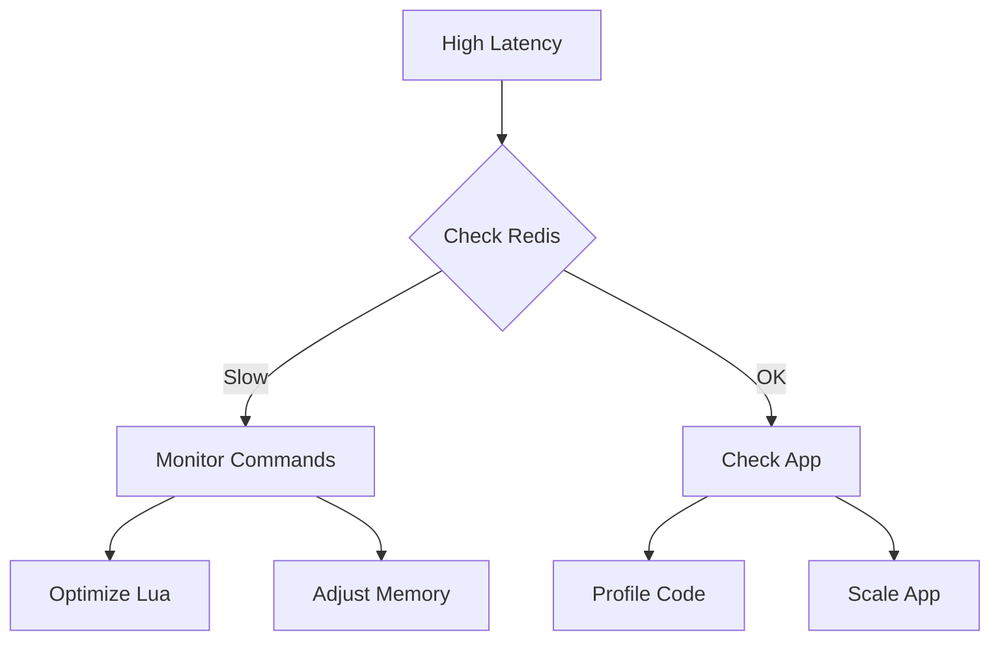

### 2. Error Rate Spike
```mermaid
flowchart TD
    A[Error Spike] --> B{Error Type}
    B -->|Redis| C[Connection Pool]
    B -->|App| D[Memory Leak]
    B -->|System| E[Resources]
    
    C --> F[Adjust Pool Size]
    D --> G[Restart App]
    E --> H[Scale Resources]
```

These benchmarks and guidelines are based on actual test results from our production environment. They provide realistic expectations for system performance and clear targets for optimization.