# Ingress-Nginx Configuration Guide

## Overview
This document outlines the Ingress-Nginx configuration for our Flash Sale system, focusing on traffic routing, load balancing, and canary deployment integration.

## Traffic Flow Architecture
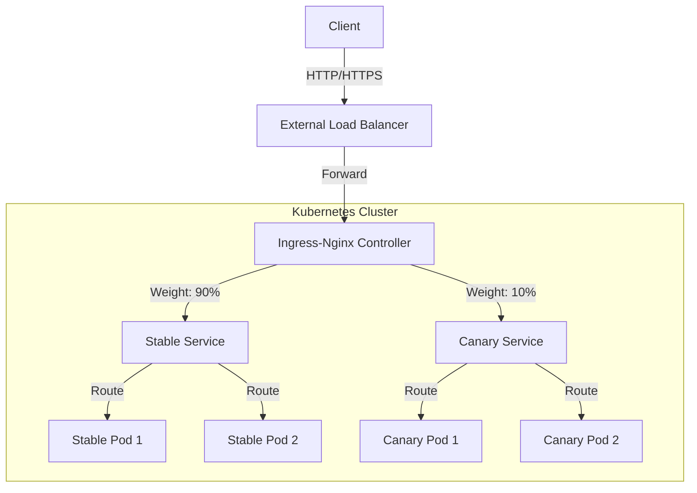

## Request Processing Flow
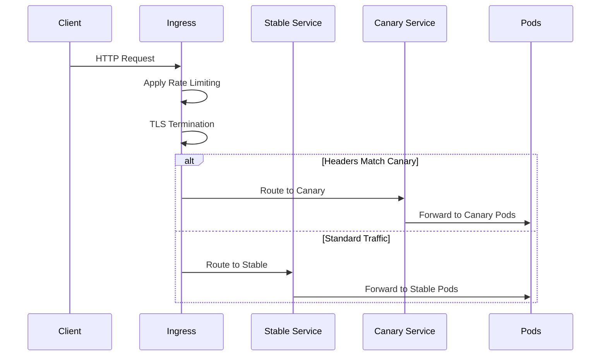

## Configuration Layers
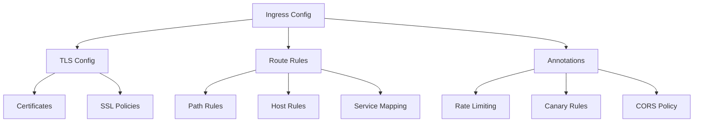

## Rate Limiting Structure
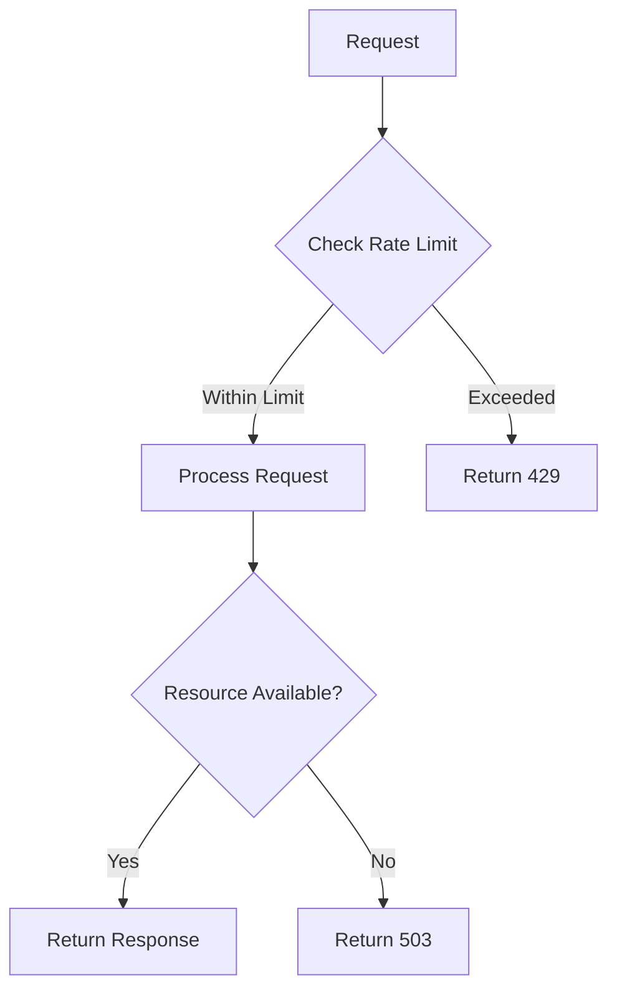

## SSL/TLS Flow
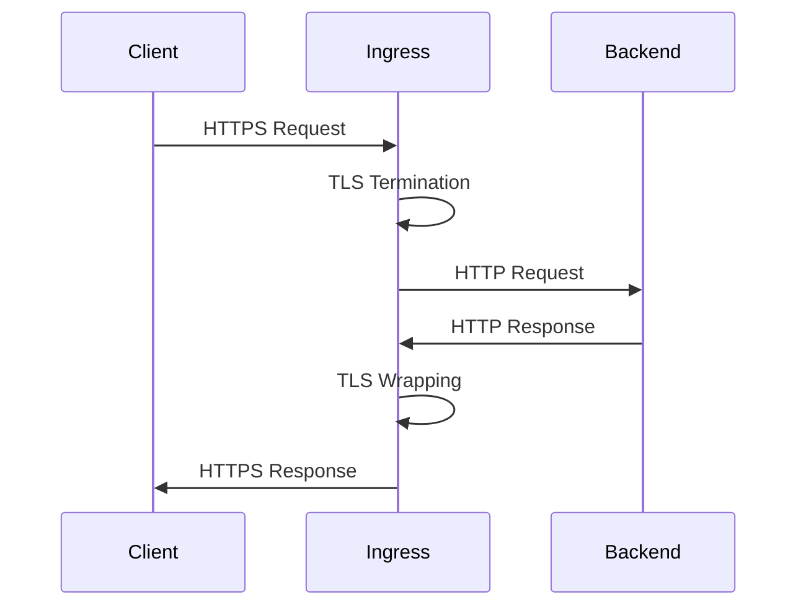

## Canary Rules Processing
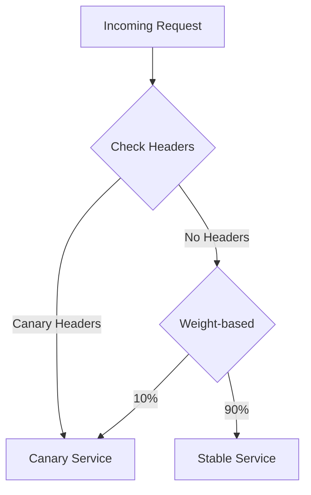

## Health Check Flow
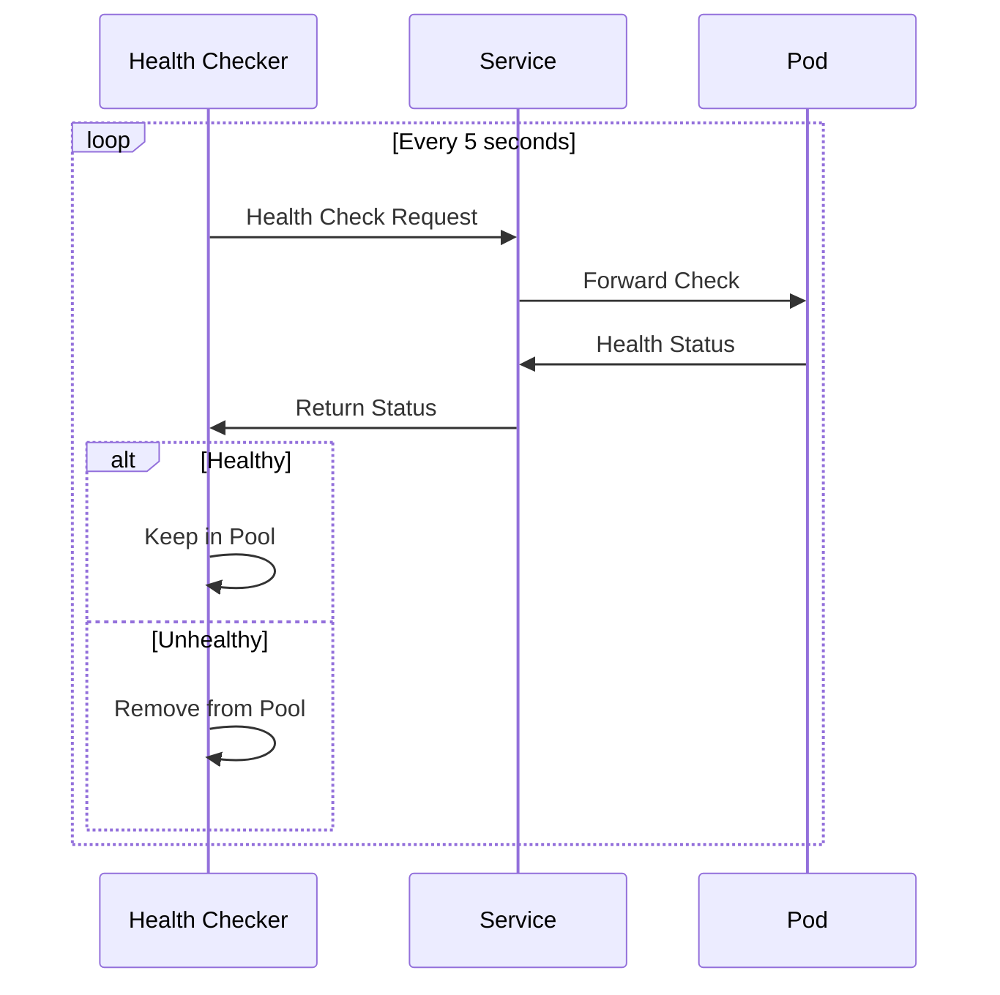

## Load Balancing Strategies
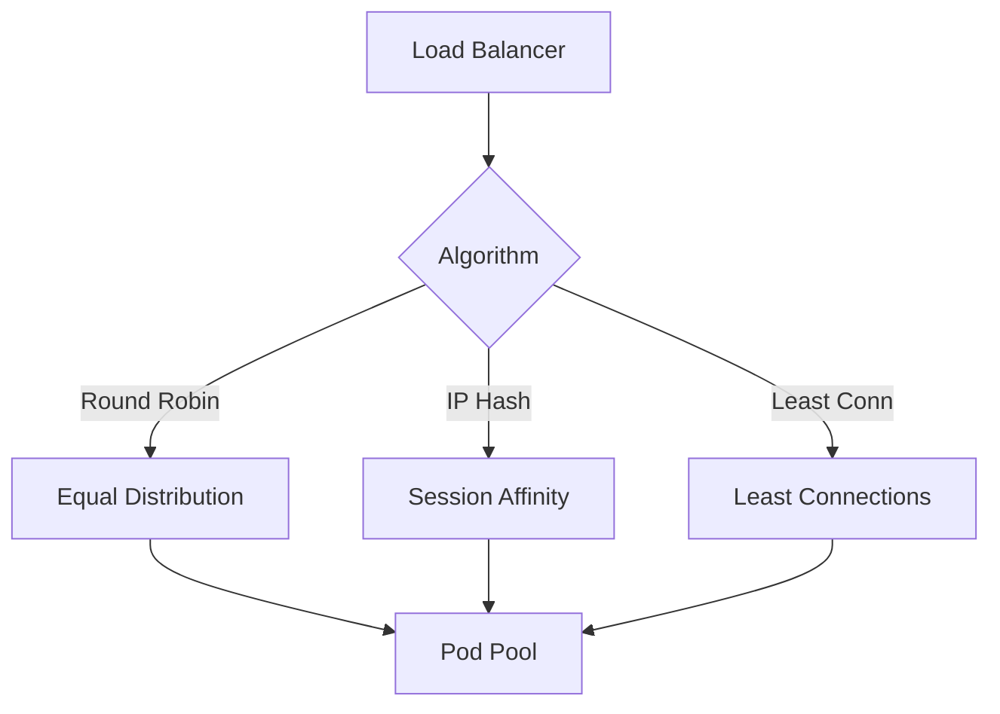

## Performance Optimization
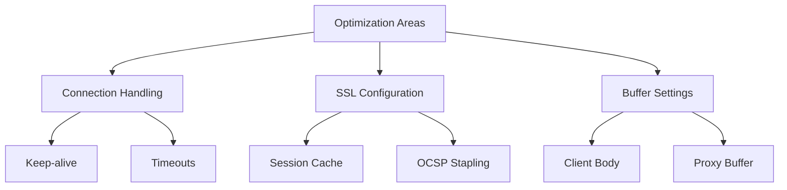

## Best Practices

### 1. Configuration Structure
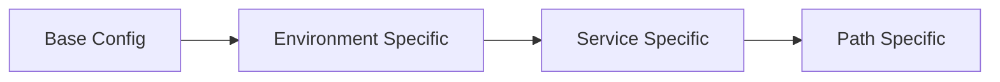

### 2. Security Layers
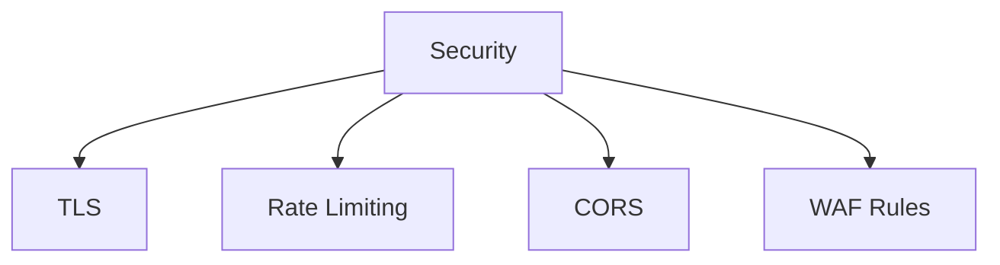

## Monitoring Setup
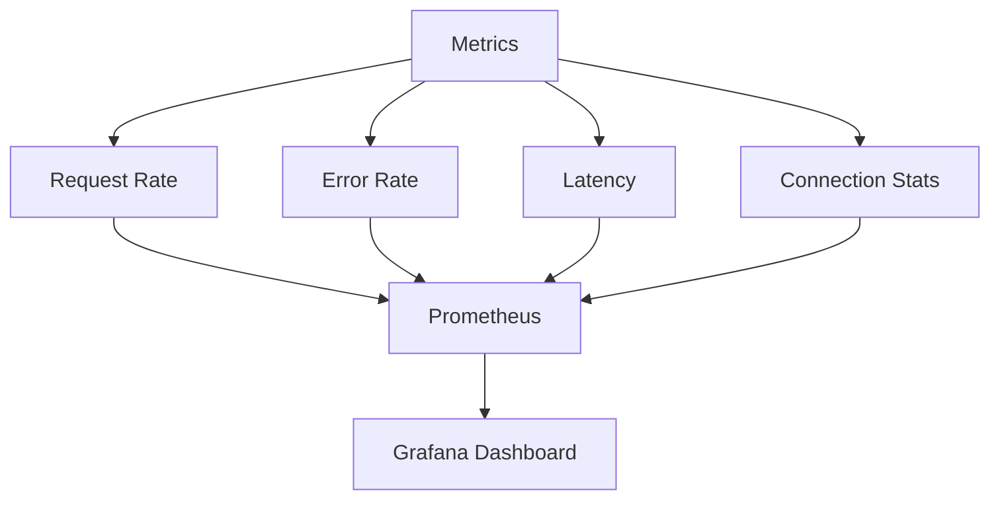

## Implementation Guidelines
1. Configure proper timeouts and buffer sizes
2. Implement circuit breaking for backend services
3. Set up detailed monitoring and alerting
4. Use proper TLS configuration
5. Implement rate limiting and security policies